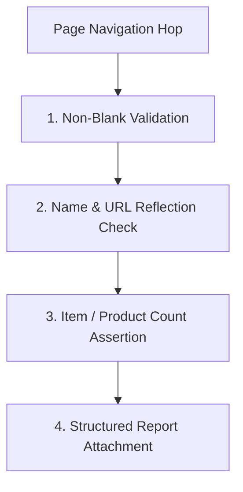

# 🚀 Hawk Search Production Sanity Test Automation Framework

---

## 📌 1. Purpose & Overview

The **Hawk Search Sanity Test Automation Suite** is an enterprise-grade automated testing framework built using **Playwright**. 

Its primary purpose is to perform fast, reliable, and continuous sanity checks on **5 live production auto parts e-commerce platforms** that share the Hawk Search architecture. It validates that the core search and navigation experiences are functioning correctly, returning non-blank pages, accurate product counts, and valid links.

---

## 🎯 2. Core Objectives

1. **Brand Catalog Verification**: Verify that the "Shop All Brands" directory is populated, and selecting any random brand navigates to a valid results page showing matching products.
2. **Category & Subcategory Hierarchy**: Navigate through all top-level categories configured for each website, randomly test **2 subcategories** per category, and confirm that both navigation and product loading succeed.
3. **Keyword Search Execution**: Simulate real user behavior by clicking the search box, typing a search keyword (`Cleaner`), pressing `Enter`, and validating that relevant products and matching URLs are returned.
4. **Site Map Deep Navigation**: Access the site map index, collect hundreds of catalog links, pick a random link, and verify deep landing page rendering.
5. **Executive Visibility & Reporting**: Provide a unified, interactive **Test Dashboard** with live search, site filters, clickable URLs, and product counts for QA and management reviews.

---

## 🏢 3. Supported Websites & Categories

The suite tests **5 distinct production websites** using a centralized configuration ([testConfig.js](tests/config/testConfig.js)):

| # | Website Name | Base URL | Configured Top-Level Categories |
| :-: | :--- | :--- | :--- |
| **1** | **ABC Auto** | `https://abcauto.com/` | • Accessories<br>• Vehicles, Equipment, Tools, and Supplies<br>• Oil, Fluids and Chemicals<br>• Garage and Shop Products |
| **2** | **shop.eapw** | `https://shop.eapw.com/` | • Vehicles, Equipment, Tools, and Supplies<br>• Oil, Fluids and Chemicals |
| **3** | **Bumper to Bumper** | `https://shopbumpertobumper.com/` | • Vehicles, Equipment, Tools, and Supplies<br>• Accessories<br>• Oil, Fluids and Chemicals<br>• Household, Shop and Office Products |
| **4** | **Auto Value Stores** | `https://autovaluestores.com/` | • Oils, Fluids, Waxes & Paint<br>• Accessories<br>• Tools & Shop Supplies<br>• Ag & Heavy Duty Parts |
| **5** | **Arnold Motors** | `https://arnoldmotorsupply.com/` | • Equipment, Tools & Supplies<br>• Accessories<br>• OILS & FLUIDS<br>• Specialty |

### 🧪 Staging Environment Spec ([hawk-search-staging.spec.js](tests/specs/hawk-search-staging.spec.js))
| # | Environment | Base URL | Configured Categories |
| :-: | :--- | :--- | :--- |
| **STG** | **Buy Auto Parts Now (Staging)** | `https://staging.buyautopartsnow.com/` | • Vehicles, Equipment, Tools, and Supplies<br>• Accessories<br>• Oil, Fluids and Chemicals<br>• Household, Shop and Office Products |

---

## 🔍 4. The 4 Test Flows (Step-by-Step)

### 1. Brand Search & Navigation
1. Open the website homepage and dismiss cookie/consent popups.
2. Click the **Brands** navigation link (or navigate to `/ShopAllBrands`).
3. Verify the Brands catalog page is **not blank**.
4. Extract all available brand links (typically 300+ brands).
5. **Randomly select 1 brand**.
6. Navigate to the selected brand's search results page.
7. Verify that the brand name appears in the title/URL and at least **1 product** is displayed.

### 2. Category & Subcategory Navigation
1. Loop through every configured top-level category for the website.
2. Navigate to the category page and verify non-blank rendering.
3. Dynamically collect all available subcategories (from facets, catalog cards, and replacement parts links).
4. **Randomly select 2 subcategories** to test.
5. For each selected subcategory:
   - Click/navigate to the subcategory page.
   - Assert that the URL changes (confirms real navigation occurred).
   - Assert the page is **not blank**.
   - Assert the subcategory name is reflected on the page or in the URL.
   - Assert that items/products or deeper sub-links are visible.
   - Return to the parent category page before proceeding to the next subcategory.

### 3. Keyword Search
1. Locate the desktop search input (`#desktop-search-form-search-box` or search field).
2. Click on the search input field.
3. Type the search keyword (default: `"Cleaner"`).
4. Press `Enter` to submit the search.
5. Assert that the search results page is **not blank**.
6. Assert that the search keyword (`Cleaner`) is reflected in the URL or page body.
7. Assert that product cards are loaded in the search results (e.g. 500+ items).

### 4. Site Map Search & Navigation
1. Open the website's Site Map URL (`/site-map` or `/sitemap`).
2. Verify the Site Map index is **not blank**.
3. Collect all valid catalog links rendered on the page (typically 100 to 500+ links).
4. **Randomly pick 1 link** from the list.
5. Navigate to the selected destination page.
6. Verify non-blank page rendering, keyword/name reflection, and product/item count.

---

## 🛡️ 5. How Validations & Assertions Work

The framework uses multi-layer assertions to ensure tests are both rigorous and resilient:



### 1. Automated Error Screen Detection (`assertNoErrorsOnPage`)
Executed automatically on **every page transition** (brands, brand products, categories, subcategories, keyword search results, and sitemap destinations):
- Scans rendered DOM text for critical HTTP and application error signatures:
  - `500 Internal Server Error`
  - `502 Bad Gateway`
  - `503 Service Unavailable`
  - `404 Page Not Found` / `404 Not Found`
  - `Something went wrong`
  - `An unexpected error occurred`
  - `Unable to process your request`
  - `Service is temporarily unavailable`
- Queries standard error container elements (`.error-page`, `.server-error`, `.page-error`, `.error-500`, `.error-404`) and asserts that none are rendered.

### 2. Non-Blank Page Validation (`assertPageIsNotBlank`)
To catch "white screen of death", broken Single Page Application (SPA) rendering, or unhandled exceptions:
- Verifies the `<body>` scroll height is non-trivial (> 100 px).
- Checks that known content containers (`main`, `#search-results-page`, `section`, `.hawk-results`, product cards) are rendered.

### 3. Name & Keyword Reflection (`assertBrandNameVisible`, `assertCategoryNameVisible`, `assertKeywordReflected`)
- Validates that the tested brand, category, or search keyword appears in the **page body text** OR is properly encoded in the **destination URL**.
- Ensures that selecting a brand or subcategory actually routed to the correct destination rather than defaulting to a generic homepage or landing page.

### 4. Product & Items Count Validation (`assertProductsVisible`, `assertItemsVisible`)
- Waits for product cards, result items, or subcategory cards to mount.
- Verifies that `count >= 1` and logs the exact item count to the test report.

### 5. Navigation Integrity (`assertUrlChangedFrom`)
- Verifies that clicking a link actually changed the URL away from the parent URL, ensuring the browser did not silently fail to navigate.

---

## ⚙️ 6. Error Handling & Anti-Flakiness Architecture

| Challenge in Production Testing | How the Framework Handles It |
| :--- | :--- |
| **Cloudflare Rate Limiting / Bot Challenges** | Configured with `workers: 1` (sequential test runs) and a realistic modern desktop Chrome User-Agent header. |
| **SPA Asynchronous DOM Hydration** | Built-in `waitForSpaContent()` helper allows the Single Page Application JavaScript to mount DOM nodes before locator counts are queried. |
| **Multi-Tenant Domain Differences** | Dynamic origin detection (`new URL(currentUrl).origin`) automatically extracts and validates links for whichever domain is currently being tested. |
| **Cookie & Consent Popups** | Automatic `beforeEach` hook checks and dismisses consent dialogs without failing if they are absent. |
| **Navigation Retries** | Network idle timeouts with fallback to `domcontentloaded` to prevent slow 3rd-party tracking scripts from blocking test execution. |

---

## 📊 7. Test Dashboard & Reporting

The framework generates a custom, self-contained **Executive Test Dashboard** after every test run:

### Automatic Dashboard Launch:
- The Executive Dashboard opens **automatically in your default browser** as soon as all tests complete (both on 100% pass and on failure).
- **File location**: [reports/hawk-search-dashboard.html](reports/hawk-search-dashboard.html)
- **Manual open command**: `npm run test:dashboard` or `npm run test:report`

### Dashboard Features:
1. **Executive KPI Cards**: Summary of total tests, pass rate, duration, and failures.
2. **Site Filter Tabs**: Toggle between `All Sites`, `ABC Auto`, `shop.eapw`, `Bumper to Bumper`, `Auto Value Stores`, and `Arnold Motors`.
3. **Structured Result Tables**:
   - Sampled Brand Name, Clickable URL, Product Count.
   - Tested Categories, Sampled Subcategories (1 & 2), Clickable URLs, Items Count.
   - Keyword Search Results URL and Total Products Found.
   - Site Map Sampled Link, Clickable Destination URL, and Items Count.
4. **Step Timelines**: Collapsible timeline for every step with timing down to milliseconds.
5. **Console Output Accordion**: Full terminal logs captured for deep debugging.
6. **Live Search**: Instant text search across all categories, links, and keywords.

---

## 💻 8. Comprehensive Command Cheatsheet

You can run test commands directly from the **Project Root** or from inside the **`hawk-search-sanity/`** folder.

### 🧪 Staging Instance Commands (`https://staging.buyautopartsnow.com/`)

| Test Scope | Headed Mode (Watch Live Browser) | Fast Headless Mode |
| :--- | :--- | :--- |
| **All 4 Staging Flows** | `npm run test:staging -- --headed` | `npm run test:staging` |
| **1. Brand Search Only** | `npm run test:staging:brand -- --headed` | `npm run test:staging:brand` |
| **2. Category Search Only** | `npm run test:staging:category -- --headed` | `npm run test:staging:category` |
| **3. Keyword Search Only** | `npm run test:staging:keyword -- --headed` | `npm run test:staging:keyword` |
| **4. Site Map Only** | `npm run test:staging:sitemap -- --headed` | `npm run test:staging:sitemap` |

---

### 🏢 Production Platform Commands (5 Live Websites)

| Website / Platform | Headed Mode (Watch Live Browser) | Fast Headless Mode |
| :--- | :--- | :--- |
| **All 5 Production Sites** | `npm test -- --headed` | `npm test` |
| **ABC Auto** | `npm run test:abcauto -- --headed` | `npm run test:abcauto` |
| **Bumper to Bumper** | `npm run test:bumper -- --headed` | `npm run test:bumper` |
| **Auto Value Stores** | `npm run test:autovalue -- --headed` | `npm run test:autovalue` |
| **Arnold Motors** | `npm run test:arnold -- --headed` | `npm run test:arnold` |
| **shop.eapw** | `npm run test:eapw -- --headed` | `npm run test:eapw` |

---

### 🔍 Production Flow-Specific Commands (Across All 5 Sites)

```bash
# Run Brand Search only on all production sites
npm run test:brand

# Run Category & Subcategory Search only on all production sites
npm run test:category

# Run Keyword Search ("Cleaner") only on all production sites
npm run test:keyword

# Run Site Map Deep Navigation only on all production sites
npm run test:sitemap
```

---

### 📊 Open Executive Test Dashboard

The dashboard opens **automatically** as soon as any test finishes. You can also manually reopen it anytime:

```bash
npm run test:dashboard
# or
npm run test:report
```

---

## 📁 9. Project Directory Structure

```text
aapa-test-scripts/
├── README.md                          # Repository overview & quick start
├── package.json                       # Root script shortcuts routing to modules
├── playwright.config.js               # Multi-folder Playwright configuration
│
├── 🦅 hawk-search-sanity/            # Dedicated Hawk Search Test Suite
│   ├── playwright.config.js           # Dedicated Playwright configuration
│   ├── package.json                   # Self-contained dependencies & NPM scripts
│   ├── HAWK_SEARCH_TEST_SUITE_DOCUMENTATION.md # Architecture & error handling docs
│   ├── reports/
│   │   ├── hawk-search-dashboard.html # Custom Executive HTML Dashboard
│   │   ├── summary.md                 # Markdown summary for Slack / Jira
│   │   └── summary.json               # Structured test result metrics
│   └── tests/
│       ├── config/
│       │   └── testConfig.js          # Multi-site definitions, categories & URLs
│       ├── helpers/
│       │   ├── navigationHelper.js    # Random selection & string sanitization
│       │   └── reportHelper.js        # Summary attachment helpers
│       ├── pages/                     # Page Object Models (POM)
│       │   ├── BasePage.js            # Error screen detection & DOM hydration
│       │   ├── HomePage.js            # Homepage actions & consent popup dismissal
│       │   ├── BrandsPage.js          # Brand directory extraction
│       │   ├── BrandResultsPage.js    # Brand product assertions
│       │   ├── CategoryPage.js        # Category landing & subcategory extraction
│       │   ├── SubcategoryPage.js     # Subcategory landing & item count checks
│       │   ├── SearchPage.js          # Keyword search execution & validation
│       │   └── SitemapPage.js         # Sitemap collection & deep landing checks
│       ├── reporters/
│       │   └── executiveDashboardReporter.js # Auto-opening interactive HTML dashboard
│       └── specs/
│           ├── hawk-search.spec.js    # Production suite (5 live platforms)
│           └── hawk-search-staging.spec.js # Staging suite (Buy Auto Parts Now)
│
└── 🔄 prod-asg-refresh/              # Dedicated ASG Refresh Validation Suite
    ├── scripts/
    │   └── Validate-Prod-ASG-Refresh.js
    ├── tests/
    │   └── Validate-Prod-ASG-Refresh.spec.js
    └── docs/
        └── Production_ASG_Refresh_doc.md
```
